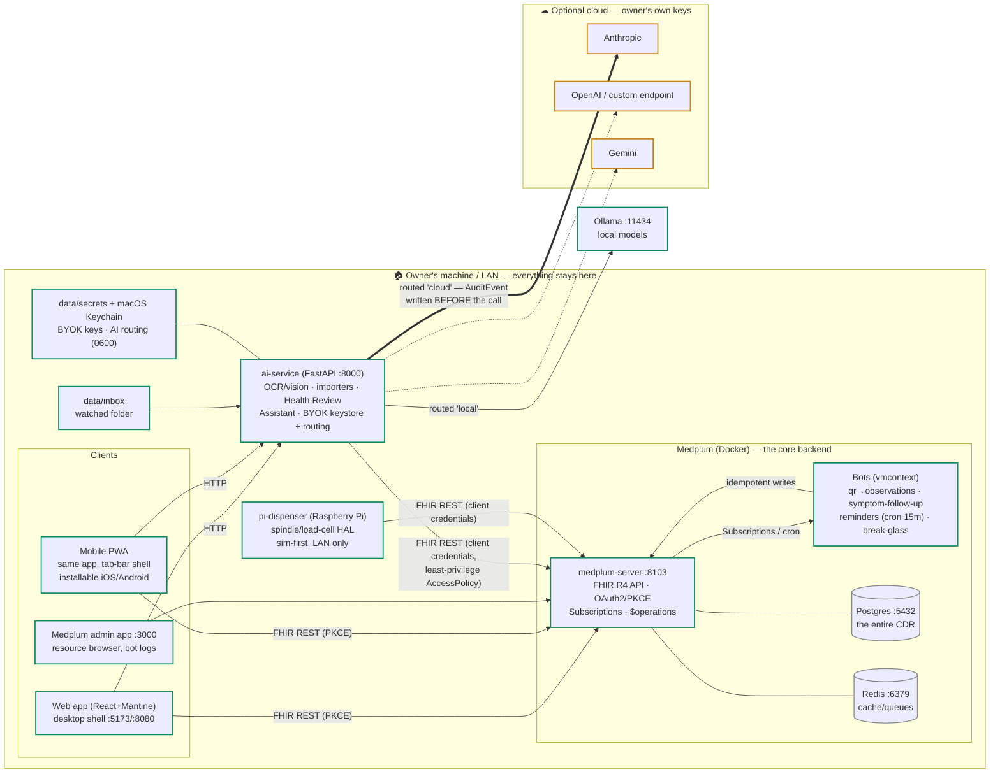
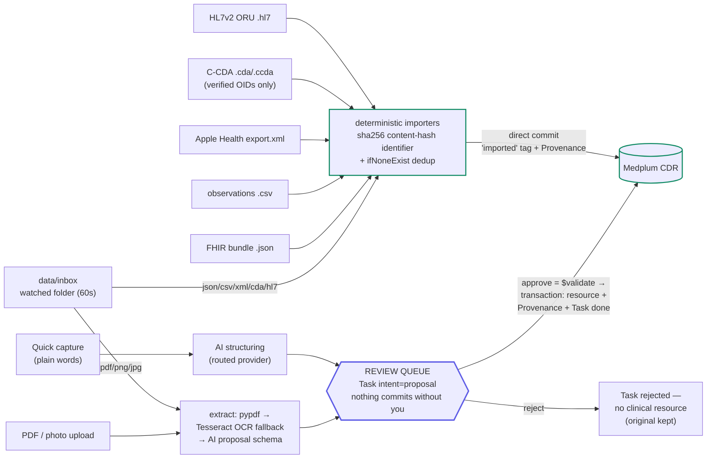
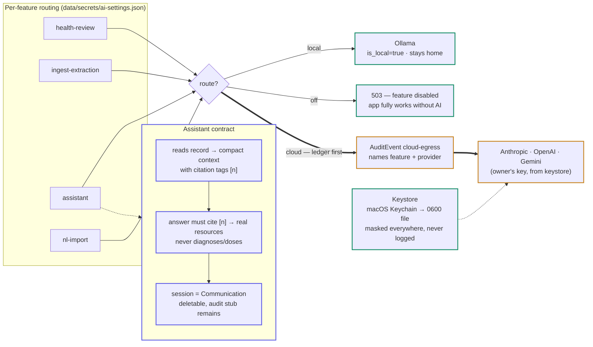
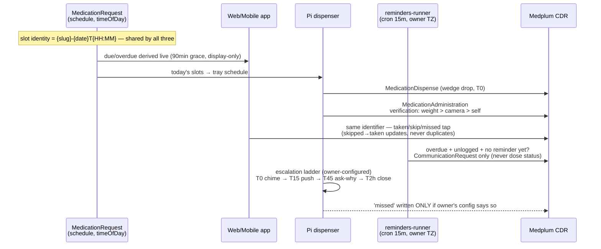
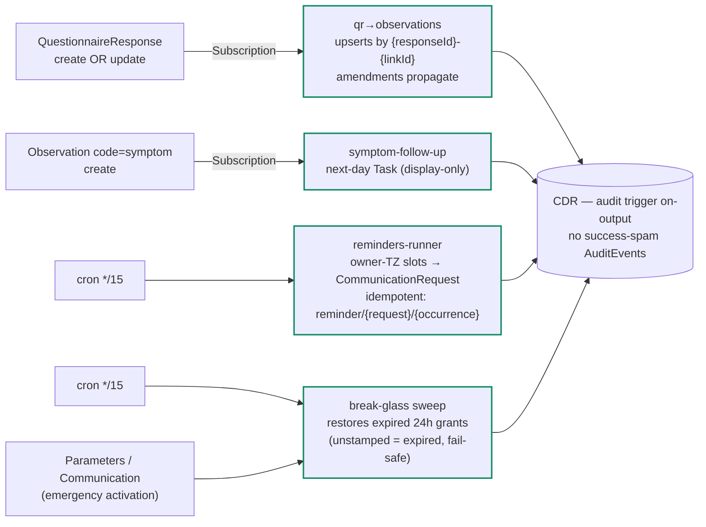
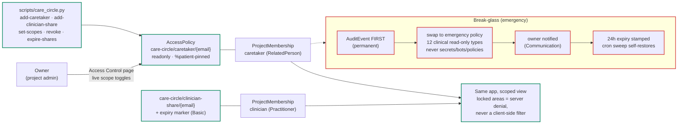
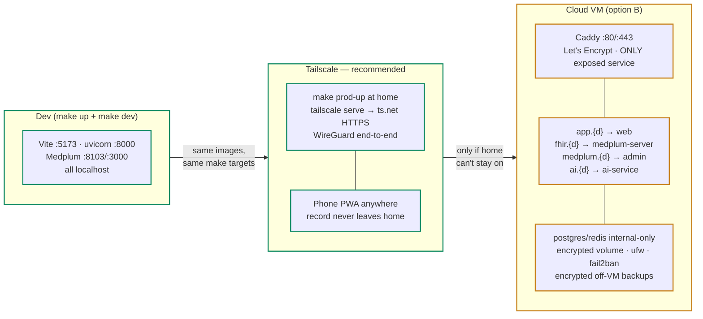
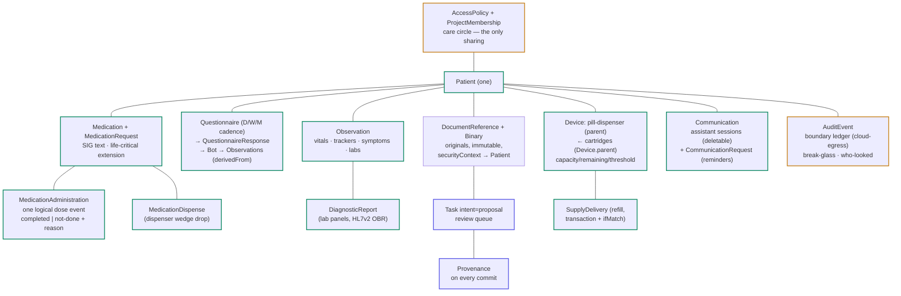

# HealMeDaily — architecture diagrams

Drawn from the repository state (2026-07-16). Rendered natively by GitHub/Claude.
A styled version of this page is published as a private artifact; sources of truth:
[CLAUDE.md](../CLAUDE.md) · [FHIR-MAPPING.md](../FHIR-MAPPING.md) · [ONBOARDING.md](../ONBOARDING.md) · [DEPLOYMENT.md](../DEPLOYMENT.md)

Color language (same as the product): green = stays home · amber = leaves the device (named recipient + ledger) · indigo = AI-derived · red = medical-safety rule.

## 01 · Platforms & components — Everything, one trust boundary

Every platform talks to one FHIR CDR. The dashed box is the owner's hardware — the only thing that ever crosses it is an explicitly-routed AI call (amber) under the owner's own key.

> no side database — if it's a health fact, it's a FHIR resource · admin is never rebuilt, the Medplum app is the admin

## 02 · Ingestion — Five ways in, one gate

AI-extracted content rides a review queue — nothing enters the record unapproved. Deterministic imports skip the queue by design but dedup on content-hash identifiers, so re-imports are no-ops. Every commit carries `Provenance`.

> originals immutable: DocumentReference + Binary (securityContext → Patient) · watcher archives to processed/ or failed/ — never double-ingests

## 03 · AI platform — BYOK, per-feature routing, loud boundaries

Four features route independently to local, cloud, or off. Keys live in the OS keychain (or an owner-only file) — never in FHIR, never in exports. Every cloud call writes a machine-coded `AuditEvent` (cloud-egress) before it fires; the History page is that ledger.

> read-only by construction: the assistant's only write is its own Communication log · NL capture proposes via the review queue, never commits

## 04 · Dose events — One logical dose, three writers, zero divergence

The app, the dispenser and the reminders bot all derive the identical slot identity `{request-slug}-{date}T{HH:MM}` — a dispenser pickup updates the same `MedicationAdministration` a tap would. No log means no resource; "missed" is never persisted from elapsed time alone.

> life-critical flag: owner-set extension, never inferred · critical gaps sort first everywhere · inventory never gates whether a med may be taken

## 05 · Automation — Bots: event-driven + cron, idempotent by law

Bot subscriptions never retry, so every bot writes through stable identifiers with conditional creates — a missed run is always recoverable, a replay is always a no-op.

> deploy: make bots — reconciles drifted Subscriptions in place, grants break-glass its admin membership, sets cron + audit triggers

## 06 · Care circle — Sharing has exactly one mechanism

Every member is a `ProjectMembership` bound to a scoped read-only `AccessPolicy` pinned to the patient. The caretaker's app is the same app — the server simply returns less. Break-glass audits before it grants.

> "who looked, lately" = AuditEvent search by member agent · every read is on the record

## 07 · Deployment topologies — Same stack, three postures

Recommended: Tailscale — access from anywhere while the record stays home. The cloud stack exists (`infra/docker-compose.cloud.yml`) but moves custody to rented hardware; only Caddy is exposed there, everything else internal-only.

> full walkthroughs in DEPLOYMENT.md · fresh-install bootstrap needs registration enabled exactly once

## 08 · Data model — FHIR resource map (orientation)

The canonical mapping lives in `FHIR-MAPPING.md` — this is the shape of it. Verified codes only (LOINC/SNOMED/RxNorm); everything else uses project-local systems under `healmedaily.local`.

> idempotency: stable business identifiers + ifNoneExist everywhere a retry can happen · transactions checked per-entry (Medplum partial-commit quirk)
